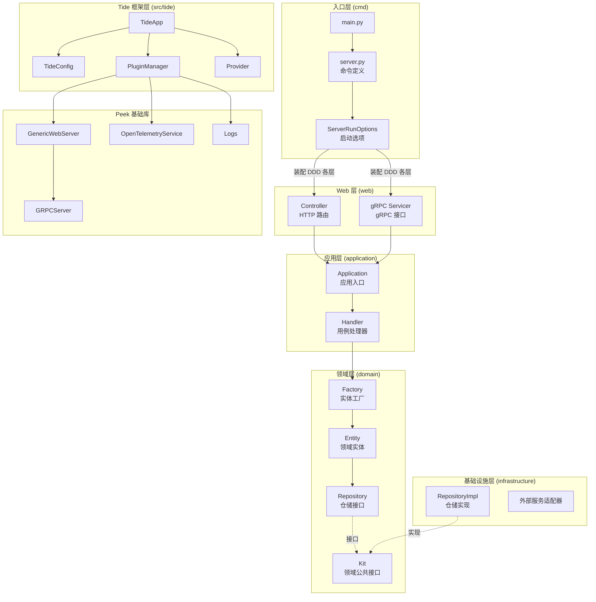
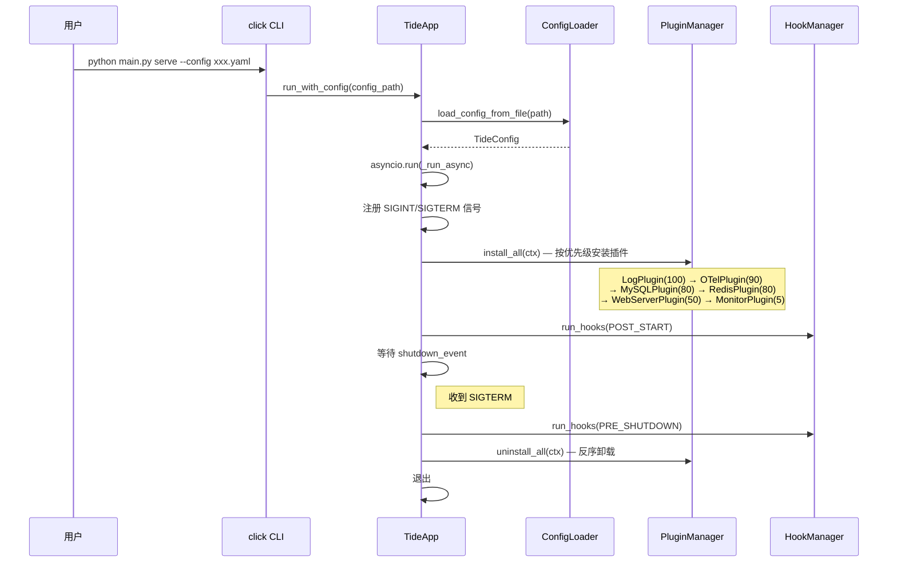
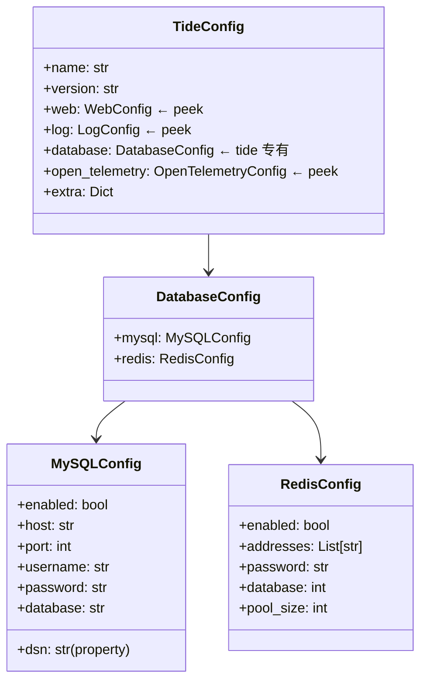
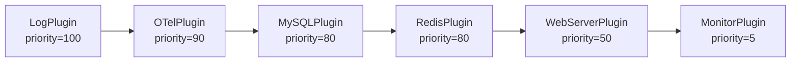
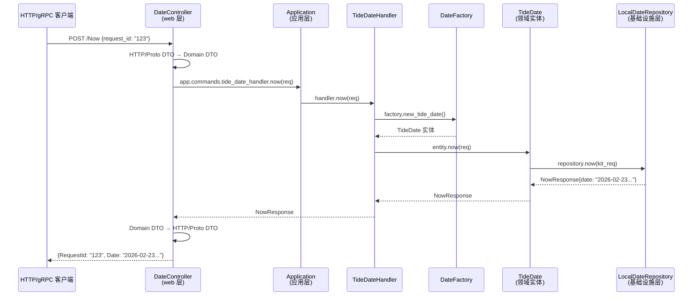
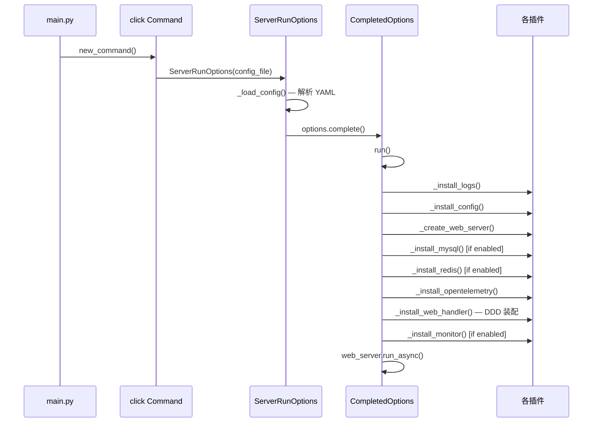
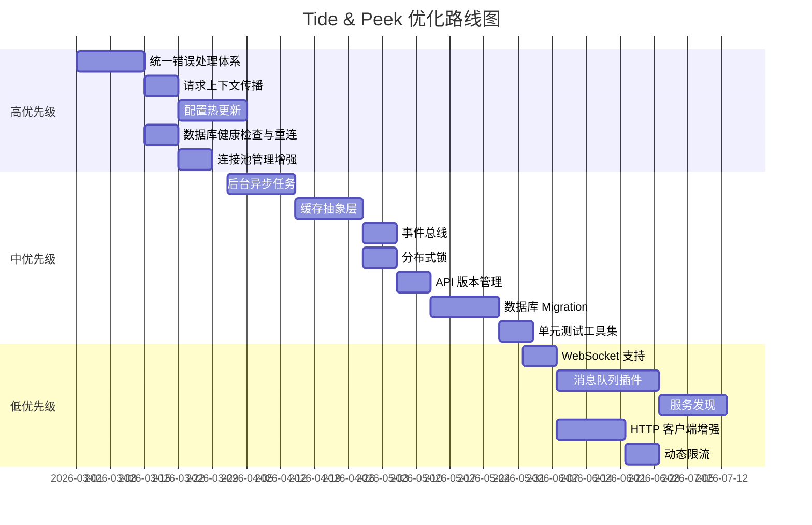

# Tide 设计文档

> **版本**: 0.1.0  
> **定位**: 基于 Peek 的 Python Web/gRPC 微服务框架  
> **参考**: Go 版本 [Sea](https://github.com/kaydxh/sea) 框架  
> **License**: MIT

---

## 1. 项目概述

### 1.1 什么是 Tide

Tide 是一个基于 [Peek](https://github.com/kaydxh/peek) 基础库的 Python Web/gRPC 服务框架，参考 Go 版本 Sea 的架构设计。它提供了从项目脚手架到生产部署的全链路开发支持。

**核心特性**：
- 🚀 **双协议支持**：同时支持 HTTP (FastAPI) 和 gRPC
- 🏗️ **DDD 架构**：采用领域驱动设计（Domain-Driven Design）分层架构
- 🔌 **插件化**：组件插件化，按需加载（日志、MySQL、Redis、OTel、监控等）
- ⚙️ **配置驱动**：YAML 配置文件 + 环境变量覆盖
- 📊 **可观测性**：集成 OpenTelemetry (Trace/Metric)
- 🛡️ **企业级特性**：QPS 限流、并发控制、健康检查、优雅关闭
- 🛠️ **CLI 脚手架**：`tide new` 一键创建标准项目结构

### 1.2 与 Peek 和 Sea 的关系

```
┌──────────────────────────────────────────────────────┐
│               业务应用                                │
│  tide-date / tide-vllm / tide-vllm-wxvideosceneaudit │
├──────────────────────────────────────────────────────┤
│                  Tide (服务框架)                       │
│  TideApp / TideConfig / Plugin / Provider / CLI      │
├──────────────────────────────────────────────────────┤
│                  Peek (基础工具库)                     │
│  BaseApp / WebServer / gRPC / OTel / Logs / ...      │
└──────────────────────────────────────────────────────┘
```

| 层级 | 职责 | 对应 Go |
|------|------|---------|
| **Peek** | 通用基础能力（Web/gRPC/日志/OTel/CV 等） | 无直接对应（类似 Go 标准库 + 基础工具包） |
| **Tide** | 服务框架（DDD 骨架、插件管理、配置体系、依赖注入） | Sea |
| **业务应用** | 具体业务逻辑 | sea-date 等 |

---

## 2. 整体架构

### 2.1 项目标准目录结构

```
tide/
├── api/                         # Proto/API 定义
│   └── protoapi_spec/
│       ├── types/               # 公共类型（Error 等）
│       └── tide_date/v1/        # 服务级 Proto 定义
├── cmd/                         # 应用入口（每个服务一个子目录）
│   ├── tide-date/               # tide-date 服务入口
│   │   ├── main.py              # 主入口
│   │   └── app/
│   │       ├── server.py        # 命令定义
│   │       └── options/         # 启动选项 & 插件装配
│   ├── tide-vllm/               # tide-vllm 服务入口
│   └── tide-vllm-wxvideosceneaudit/
├── conf/                        # 配置文件
│   ├── tide-date.yaml
│   ├── tide-vllm.yaml
│   └── tide-vllm-wxvideosceneaudit.yaml
├── pkg/                         # 业务逻辑（DDD 分层）
│   ├── tide_date/               # tide-date 业务包
│   │   ├── application/         # 应用层
│   │   ├── domain/              # 领域层
│   │   ├── infrastructure/      # 基础设施层
│   │   └── provider/            # 依赖注入
│   ├── tide_vllm/               # tide-vllm 业务包
│   └── tide_vllm_wxvideosceneaudit/
├── web/                         # Web 控制器层
│   └── modules/
│       ├── tidedate/            # tide-date 的 HTTP/gRPC 控制器
│       ├── tidevllm/            # tide-vllm 的 HTTP 控制器
│       └── tidevllmwxvideosceneaudit/
├── src/tide/                    # Tide 框架核心源码
│   ├── app/                     # 应用核心
│   ├── config/                  # 配置管理
│   ├── plugins/                 # 内置插件
│   ├── provider/                # 依赖注入
│   └── cli.py                   # CLI 脚手架
├── tests/                       # 测试
├── docker/                      # Docker 构建
├── scripts/                     # 脚本
└── docs/                        # 文档
```

### 2.2 架构分层图



---

## 3. 核心模块详细设计

### 3.1 TideApp — 应用主类

`TideApp` 继承 Peek 的 `BaseApp`，是 Tide 框架的入口类。

```python
class TideApp(BaseApp):
    """
    Tide 应用主类
    - 继承 peek.app.BaseApp 的生命周期管理（信号处理、插件管理、钩子机制）
    - 使用 TideConfig 配置加载
    - 使用 Tide 专用 Provider
    """
```

**生命周期时序**：



### 3.2 配置管理 (`tide.config`)

#### 3.2.1 TideConfig — 主配置模型

`TideConfig` 基于 Pydantic v2，组合了通用配置（来自 Peek）和业务专有配置：



**配置来源与优先级**：

```
YAML 文件 → 环境变量覆盖（前缀 TIDE_）→ Pydantic 默认值
```

#### 3.2.2 ConfigLoader

```python
from tide.config import load_config_from_file

# 从 YAML 文件加载（自动应用环境变量覆盖）
config = load_config_from_file("conf/tide-date.yaml")

# 从字典加载
config = load_config({"name": "my-service", "web": {"bind_address": {"port": 8080}}})
```

### 3.3 插件系统 (`tide.plugins`)

Tide 的插件系统继承自 Peek，提供 6 个内置插件：

| 插件 | 优先级 | 条件安装 | 说明 |
|------|--------|---------|------|
| `LogPlugin` | 100 | 始终安装 | 桥接 TideConfig → peek.logs |
| `OpenTelemetryPlugin` | 90 | `open_telemetry.enabled=true` | 桥接 TideConfig → peek.opentelemetry |
| `MySQLPlugin` | 80 | `database.mysql.enabled=true` | SQLAlchemy 异步引擎 |
| `RedisPlugin` | 80 | `database.redis.enabled=true` | redis.asyncio 客户端 |
| `WebServerPlugin` | 50 | 始终安装 | 桥接 TideConfig → peek.net.webserver |
| `MonitorPlugin` | 5 | `monitor.enabled=true` | 桥接 TideConfig → peek.os.monitor |

**插件安装流程**：



**自定义插件**：

```python
from tide.app.plugin import Plugin

class MyPlugin(Plugin):
    name = "my-plugin"
    priority = 60

    def should_install(self, ctx):
        return ctx.config.extra.get("my_feature_enabled", False)

    async def install(self, ctx):
        # 初始化资源
        client = MyClient(...)
        ctx.provider.register("my_client", client)

    async def uninstall(self, ctx):
        # 清理资源
        client = ctx.provider.get("my_client")
        if client:
            await client.close()
```

### 3.4 Provider — 依赖注入容器

`Provider` 继承 Peek 的 `BaseProvider`，添加了业务常用的快捷方法：

```python
from tide.provider import get_provider

provider = get_provider()

# 快捷方法
provider.set_mysql(engine)       # → provider.register("mysql", engine)
provider.set_redis(client)       # → provider.register("redis", client)
provider.set_tracer(tracer)      # → provider.register("tracer", tracer)
provider.set_meter(meter)        # → provider.register("meter", meter)

# 获取
engine = provider.get_mysql()
client = provider.get_redis()

# 通用注册
provider.register("webserver", server)
server = provider.get("webserver")
```

### 3.5 CLI 脚手架 (`tide.cli`)

Tide 提供 `tide` 命令行工具：

```bash
# 创建新项目
tide new my-service

# 在当前目录初始化
tide init

# 查看框架信息
tide info
```

`tide new` 自动生成完整的 DDD 项目结构：

```
my-service/
├── api/
├── cmd/my_service/
│   ├── main.py                  # 入口（含插件注册）
│   └── app/plugins/
├── pkg/my_service/
│   ├── application/
│   ├── domain/
│   ├── infrastructure/
│   └── provider/
├── web/
├── conf/config.yaml             # 默认配置
├── tests/
├── Makefile
├── pyproject.toml
└── .gitignore
```

---

## 4. DDD 分层架构详解

### 4.1 分层模型

Tide 参考 Sea (Go) 的 DDD 分层设计，每个业务服务包含以下四层：

```
┌─────────────────────────────────────────────────────────┐
│              Web Layer (Controller / gRPC Servicer)      │
│          HTTP/gRPC 请求解析、响应构造、路由注册           │
└───────────────────────────┬─────────────────────────────┘
                            │ 调用
┌───────────────────────────▼─────────────────────────────┐
│                    Application Layer                     │
│             Application + Commands + Handler             │
│               用例编排、请求/响应 DTO 转换               │
└───────────────────────────┬─────────────────────────────┘
                            │ 调用
┌───────────────────────────▼─────────────────────────────┐
│                      Domain Layer                        │
│       Entity（领域实体）/ Factory（工厂）/               │
│       Repository（仓储接口）/ Kit（公共接口）            │
└───────────────────────────┬─────────────────────────────┘
                            │ 依赖倒置
┌───────────────────────────▼─────────────────────────────┐
│                  Infrastructure Layer                    │
│             Repository 实现 / 外部服务适配器             │
└─────────────────────────────────────────────────────────┘
```

### 4.2 以 tide-date 为例的完整数据流



### 4.3 各层职责与代码对应

#### Web 层 (`web/modules/`)

| 文件 | 职责 |
|------|------|
| `controller.py` | HTTP 路由注册、请求解析、响应构造 |
| `grpc_servicer.py` | gRPC Servicer 实现，转发到 Application 层 |
| `error.py` | API 错误码映射 |

**Controller 统一模式**：
```python
class DateController:
    def __init__(self, app: Application):
        self._app = app

    def register_routes(self, web_server):
        app = getattr(web_server, 'app', None) or getattr(web_server, 'router')

        @app.post("/Now")
        async def now(request: NowRequest):
            return await self.now(request)

    async def now(self, req: NowRequest) -> NowResponse:
        domain_req = DomainNowRequest(request_id=req.request_id)
        domain_resp = await self._app.commands.tide_date_handler.now(domain_req)
        return NowResponse(request_id=req.request_id, date=domain_resp.date)
```

#### 应用层 (`pkg/xxx/application/`)

| 文件 | 职责 |
|------|------|
| `application.py` | 定义 `Application` 和 `Commands` 容器 |
| `xxx_handler.py` | 具体用例处理器，调用领域层 |

**Application 统一模式**：
```python
@dataclass
class Commands:
    tide_date_handler: TideDateHandler = None

@dataclass
class Application:
    commands: Commands = None
```

#### 领域层 (`pkg/xxx/domain/`)

| 文件 | 职责 |
|------|------|
| `entity.py` | 领域实体，封装核心业务逻辑 |
| `factory.py` | 实体工厂，封装实体创建 |
| `repository.py` | 仓储接口（抽象类） |
| `error.py` | 领域错误定义 |
| `kit/` | 公共领域接口（被 Entity 和 Infrastructure 共同依赖） |

**依赖倒置原则**：
- Entity 依赖 Kit 中的 Repository 接口
- Infrastructure 层实现 Kit 中的 Repository 接口
- 通过 Factory 注入具体实现

#### 基础设施层 (`pkg/xxx/infrastructure/`)

| 文件 | 职责 |
|------|------|
| `local/xxx_repository.py` | 本地实现的仓储 |
| `vllm/xxx_repository.py` | vLLM 外部服务适配器 |

### 4.4 DDD 组装（装配线）

DDD 各层的装配在 `cmd/xxx/app/options/plugin_web_handler.py` 中完成：

```python
def install_web_handler(web_server):
    """DDD 装配线 — 自底向上组装各层"""

    # 1. 基础设施层：创建仓储实现
    repo = LocalDateRepository()

    # 2. 领域层：创建工厂（注入仓储）
    factory = DateFactory(FactoryConfig(date_repository=repo))

    # 3. 应用层：创建 Handler 和 Application
    app = Application(commands=Commands(
        tide_date_handler=TideDateHandler(factory)
    ))

    # 4. Web 层：创建 Controller（注入 Application）并注册路由
    controller = DateController(app)
    controller.register_routes(web_server)

    # 5. gRPC 层：注册 gRPC Servicer
    register_grpc_servicer(web_server, app)
```

---

## 5. 业务实例

### 5.1 tide-date — 日期服务（基础示例）

最简单的示例服务，演示完整的 DDD 分层和 HTTP/gRPC 双协议支持。

**Proto 定义**：
```protobuf
service TideDateService {
  rpc Now(NowRequest) returns (NowResponse);
  rpc NowError(NowErrorRequest) returns (NowErrorResponse);
}
```

**API 端点**：

| 协议 | 端点 | 说明 |
|------|------|------|
| HTTP | `GET/POST /Now` | 获取当前时间 |
| HTTP | `GET/POST /NowError` | 获取时间（模拟错误） |
| gRPC | `TideDateService/Now` | gRPC 获取当前时间 |
| gRPC | `TideDateService/NowError` | gRPC 获取时间（模拟错误） |

**启动方式**：
```bash
python cmd/tide-date/main.py --config conf/tide-date.yaml
```

**测试请求**：
```bash
# HTTP
curl -X POST http://localhost:10001/Now \
  -H "Content-Type: application/json" \
  -d '{"RequestId": "test-123"}'

# gRPC (使用 grpcurl)
grpcurl -plaintext -d '{"request_id": "test-123"}' \
  localhost:10002 tide.api.tidedate.TideDateService/Now
```

### 5.2 tide-vllm — vLLM 聊天服务

基于 vLLM 的大语言模型推理服务，使用千问3 (Qwen3) 模型。

**API 端点**：

| 端点 | 说明 |
|------|------|
| `GET /health` | 健康检查 |
| `POST /chat/completions` | 聊天补全 |
| `POST /v1/chat/completions` | OpenAI 兼容接口 |

**请求示例**：
```bash
curl -X POST http://localhost:10002/chat/completions \
  -H "Content-Type: application/json" \
  -d '{
    "prompt": "你好，请介绍一下你自己",
    "system_prompt": "你是一个友好的AI助手",
    "max_tokens": 512
  }'
```

### 5.3 tide-vllm-wxvideosceneaudit — 视频场景审核

基于 vLLM 的微信视频场景审核服务，对视频进行门头/店内/流动经营场景审核。

**API 端点**：

| 端点 | 说明 |
|------|------|
| `GET /health` | 健康检查 |
| `POST /wx_video_scene_audit` | 视频场景审核 |

**请求示例**：
```bash
curl -X POST http://localhost:10003/wx_video_scene_audit \
  -H "Content-Type: application/json" \
  -d '{
    "request_id": "req_001",
    "video": "<base64_encoded_video>"
  }'
```

---

## 6. 服务启动流程

### 6.1 基于 Options 模式的启动流程

Tide 参考 Sea 的 Options 模式，服务启动遵循以下流程：



### 6.2 Complete 模式

参考 Sea 的 `Complete()` 模式——在运行前通过 `complete()` 方法补全默认值：

```python
options = ServerRunOptions(config_file)
completed = options.complete()  # 返回 CompletedServerRunOptions
await completed.run()           # 只有 Completed 版本才能调用 run()
```

这确保了配置在运行前已经过校验和补全。

---

## 7. gRPC 支持

### 7.1 Proto 定义规范

```
api/protoapi_spec/
├── types/                      # 公共类型
│   └── error.proto             # 统一错误类型
├── tide_date/v1/               # 服务级定义
│   └── api.proto
└── <service_name>/v1/
    └── api.proto
```

**命名规范**：
- Package: `tide.api.<service_name>`
- Import: 使用相对于 `api/protoapi_spec` 的路径
- 类型引用: 使用完整 package 路径（如 `tide.api.types.Error`）

### 7.2 Proto 编译

```bash
# 检查工具
make proto-check

# 编译所有
make proto

# 编译指定服务
make proto-service SERVICE=tide_date/v1

# 清理
make proto-clean
```

### 7.3 gRPC Servicer 实现

gRPC Servicer 在 `web/modules/xxx/grpc_servicer.py` 中实现，模式与 HTTP Controller 一致：

```python
class TideDateGRPCServicer(api_pb2_grpc.TideDateServiceServicer):
    def __init__(self, app: Application):
        self._app = app

    def Now(self, request, context):
        domain_req = DomainNowRequest(request_id=request.request_id)
        domain_resp = loop.run_until_complete(
            self._app.commands.tide_date_handler.now(domain_req)
        )
        return api_pb2.NowResponse(request_id=request.request_id, date=domain_resp.date)
```

注册方式：
```python
web_server.register_grpc_service(
    lambda server: api_pb2_grpc.add_TideDateServiceServicer_to_server(servicer, server),
    service_name="tide.api.tidedate.TideDateService",
)
```

---

## 8. 配置参考

### 8.1 完整 YAML 配置示例

```yaml
# ============ 日志配置 ============
log:
  formatter: glog              # glog / text / json
  level: info
  filepath: ./log
  max_age: 604800s             # 7天
  max_count: 200
  rotate_interval: 3600s       # 1小时轮转
  rotate_size: 104857600       # 100MB
  report_caller: true
  redirect: stdout             # stdout / file / both

# ============ Web 服务器配置 ============
web:
  bind_address:
    host: "0.0.0.0"
    port: 10001

  grpc:
    enabled: true
    port: 10002
    timeout: 0s                # 0 = 不超时

  http:
    api_formatter: trivial_api_v20

  # OpenTelemetry 配置
  open_telemetry:
    enabled: true
    metric_collect_duration: 60s
    otel_metric_exporter_type: metric_otlp
    otel_metric_exporter:
      otlp:
        endpoint: "opentelemetry.access.monitor.tencent-cloud.net:4318"
        protocol: "http"
    otel_trace_exporter_type: trace_otlp
    otel_trace_exporter:
      otlp:
        endpoint: "trace.zhiyan.tencent-cloud.net:4318"
        protocol: "http"
    resource:
      service_name: "my-service"
      k8s:
        enabled: true

  # QPS 限流配置
  qps_limit:
    grpc:
      default_qps: 0          # 0 = 不限制
      max_concurrency: 10
      method_qps: []           # 方法级配置
    http:
      default_qps: 0
      max_concurrency: 10
      method_qps: []

# ============ 数据库配置 ============
database:
  mysql:
    enabled: false
    address: "localhost:3306"
    username: "root"
    password: ""
    db_name: "tide"
    max_connections: 100
    max_idle_connections: 10
  redis:
    enabled: false
    addresses:
      - "localhost:6379"
    password: ""
    db: 0
    max_connections: 100

# ============ 进程监控配置 ============
monitor:
  enabled: true
  auto_start: true
  interval: 5                  # 采集间隔（秒）
  enable_gpu: false
  include_children: true
  history_size: 3600           # 3600 条 × 5s = 5 小时
```

### 8.2 环境变量覆盖

环境变量前缀为 `TIDE_`，下划线分隔映射到嵌套配置：

```bash
export TIDE_WEB_BIND_ADDRESS_PORT=9090
export TIDE_LOG_LEVEL=debug
export TIDE_DATABASE_MYSQL_ENABLED=true
```

---

## 9. 使用指南

### 9.1 安装

```bash
# 开发环境安装（推荐）
./scripts/dev_install.sh

# 手动安装
pip install -e .                    # 基础安装
pip install -e ".[all]"             # 全部依赖
pip install -e ".[dev]"             # 开发工具
pip install -e ".[database]"        # 数据库驱动
pip install -e ".[observability]"   # OpenTelemetry
```

### 9.2 快速创建新服务

#### 方式一：使用 CLI 脚手架

```bash
tide new my-service
cd my-service
pip install -e .
python cmd/my_service/main.py serve --config conf/config.yaml
```

#### 方式二：手动创建（参考 tide-date）

1. **定义 Proto** (`api/protoapi_spec/my_service/v1/api.proto`)
2. **编译 Proto** (`make proto-service SERVICE=my_service/v1`)
3. **实现领域层** (`pkg/my_service/domain/`)
4. **实现基础设施层** (`pkg/my_service/infrastructure/`)
5. **实现应用层** (`pkg/my_service/application/`)
6. **实现 Web 层** (`web/modules/myservice/controller.py`)
7. **创建入口** (`cmd/my-service/main.py`)
8. **编写配置** (`conf/my-service.yaml`)

### 9.3 运行服务

```bash
# tide-date
python cmd/tide-date/main.py --config conf/tide-date.yaml

# tide-vllm
python cmd/tide-vllm/main.py --config conf/tide-vllm.yaml

# tide-vllm-wxvideosceneaudit
python cmd/tide-vllm-wxvideosceneaudit/main.py --config conf/tide-vllm-wxvideosceneaudit.yaml
```

### 9.4 开发命令

```bash
# 构建
make build

# 测试（含覆盖率）
make test

# 代码检查
make lint

# 格式化
make format

# 清理
make clean

# Proto 编译
make proto
make proto-service SERVICE=tide_date/v1
make proto-clean
make proto-list

# 创建新项目
make new TARGET=my-service
```

### 9.5 Docker 部署

```bash
# 构建镜像
docker build -f docker/Dockerfile.tide-vllm-wxvideosceneaudit -t tide-wxvideo .

# 运行
docker run -p 10003:10003 tide-wxvideo
```

---

## 10. 依赖说明

### 10.1 核心依赖

| 依赖 | 版本 | 用途 |
|------|------|------|
| `peek` | 本地开发 | 基础工具库 |
| `click` | ≥8.1.0 | CLI 框架 |
| `rich` | ≥13.0.0 | CLI 美化输出 |
| `pydantic` | ≥2.0.0 | 数据校验与配置 |
| `pydantic-settings` | ≥2.0.0 | 配置管理 |
| `PyYAML` | ≥6.0 | YAML 解析 |
| `fastapi` | ≥0.100.0 | HTTP 框架 |
| `uvicorn` | ≥0.23.0 | ASGI 服务器 |
| `httpx` | ≥0.25.0 | 异步 HTTP 客户端 |
| `grpcio` | ≥1.57.0 | gRPC 框架 |
| `grpcio-tools` | ≥1.57.0 | Proto 编译工具 |

### 10.2 可选依赖

| 分组 | 依赖 | 用途 |
|------|------|------|
| `database` | `sqlalchemy`, `aiomysql`, `redis`, `aioredis` | 数据库驱动 |
| `observability` | `opentelemetry-*` | 可观测性 |
| `dev` | `pytest`, `black`, `mypy`, `flake8`, `pylint` | 开发工具 |

---

## 11. 设计决策

### 11.1 为什么参考 Go Sea 框架？

- Sea 已在生产环境验证，DDD 分层模式清晰
- Go 与 Python 的微服务架构理念可以复用
- 方便团队在 Go/Python 技术栈间切换（相同的目录结构、配置格式、DDD 模式）

### 11.2 为什么分离 Peek 和 Tide？

| | Peek | Tide |
|---|---|---|
| **定位** | 通用基础库 | 服务框架 |
| **业务相关** | 否 | 是 |
| **独立使用** | 可以 | 依赖 Peek |
| **包含内容** | WebServer/gRPC/日志/OTel/CV/时间工具 | DDD 骨架/插件/配置/CLI |

分离的好处：
- Peek 可独立用于非 Web 场景（如 CLI 工具、数据处理脚本）
- Tide 专注于服务框架能力，不引入不必要的基础依赖

### 11.3 Options + Complete 模式

参考 Sea (Go) 的 cobra + options 模式：
- `ServerRunOptions`：解析配置，保持各配置的原始状态
- `CompletedServerRunOptions`：补全默认值后才允许调用 `run()`
- 通过类型约束确保不会跳过 `complete()` 步骤

### 11.4 Kit 层（领域公共接口）

`domain/kit/` 是 DDD 分层中用于解耦领域层和基础设施层的关键：
- Kit 定义 Repository 接口和 DTO
- Entity 依赖 Kit 接口（而非直接依赖 Infrastructure）
- Infrastructure 实现 Kit 接口
- 实现了 **依赖倒置原则（DIP）**

---

## 12. 功能增强与优化路线图

基于当前 Tide 和 Peek 的实现现状，从 **架构完善、可靠性增强、开发体验、性能优化、可观测性、安全、生态** 七个维度，按优先级分为三档规划后续演进方向。

### 12.1 现状评估

| 维度 | 现状评价 | 关键差距 |
|------|---------|---------|
| **架构设计** | ⭐⭐⭐⭐ DDD 分层清晰，Peek/Tide 分离合理 | 缺少事件总线、请求上下文传播 |
| **可靠性** | ⭐⭐⭐ 有健康检查和优雅关闭 | 缺少数据库健康检查、连接重试、配置热更新 |
| **可观测性** | ⭐⭐⭐⭐ OTel 集成完善，有进程监控 | 缺少连接池指标上报、统一错误码 |
| **开发体验** | ⭐⭐⭐ 有 CLI 脚手架和集成测试 | 缺少单测工具集、DB Migration、缓存装饰器 |
| **性能** | ⭐⭐⭐ 有 QPS 限流和并发控制 | 缺少多 worker 配置、大报文日志优化 |
| **安全** | ⭐⭐ 有 CORS | 需增加认证/授权中间件、分布式锁 |
| **生态** | ⭐⭐⭐ 有 MySQL/Redis | 需增加消息队列、缓存层、服务发现 |

---

### 12.2 🔴 高优先级（核心能力缺失）

#### 12.2.1 配置热更新 (Config Watch / Hot Reload)

**现状**：配置只在启动时加载一次，运行时修改 YAML 需要重启服务。

**建议**：在 `peek.config` 中增加 `ConfigWatcher`，支持 YAML 文件变更监听 + 回调通知。

```
peek/config/
├── loader.py        # 已有
├── schema.py        # 已有
└── watcher.py       # 新增：配置文件热监听
```

核心思路：
- 使用 `watchdog` 库监听文件变更
- 提供 `on_config_changed(callback)` 注册机制
- 插件层实现 `on_reload()` 方法，支持连接池大小/日志级别等动态调整
- Go 版本 Sea 有类似的 `viper.WatchConfig` 机制

#### 12.2.2 错误处理体系标准化

**现状**：错误处理比较零散，各层随意抛异常，没有统一的业务错误码体系。

**建议**：在 `peek` 中建立统一错误体系：

```python
# peek/errors/errors.py
class AppError(Exception):
    """应用统一错误基类"""
    def __init__(self, code: int, message: str, details: dict = None):
        self.code = code
        self.message = message
        self.details = details or {}

class NotFoundError(AppError): ...
class ValidationError(AppError): ...
class PermissionDeniedError(AppError): ...
class InternalError(AppError): ...
```

并在中间件层自动将 `AppError` 转换为对应的 HTTP 状态码 / gRPC Status Code：

| AppError | HTTP | gRPC Status |
|----------|------|-------------|
| `NotFoundError` | 404 | NOT_FOUND |
| `ValidationError` | 400 | INVALID_ARGUMENT |
| `PermissionDeniedError` | 403 | PERMISSION_DENIED |
| `InternalError` | 500 | INTERNAL |

#### 12.2.3 数据库连接池健康检查 & 自动重连

**现状**：MySQL/Redis 插件创建连接后没有健康检查机制。如果数据库重启，连接池中的连接全部失效。

**建议**：
- MySQL：增加 `pool_pre_ping=True` 参数（SQLAlchemy 内置支持）
- Redis：增加定期 `PING` 检测，配合 `peek.time.backoff` 重试机制
- 将 MySQL/Redis 的健康状态注册到 `HealthzController` 的 `readyz_checkers`

```python
# 注册数据库健康检查
healthz.add_readyz_checker(
    TCPHealthChecker("mysql", host="...", port=3306)
)
healthz.add_readyz_checker(
    FuncHealthChecker("redis", lambda: redis_client.ping())
)
```

#### 12.2.4 请求上下文传播 (Context Propagation)

**现状**：`request_id` 通过 `RequestIDMiddleware` 生成，但没有统一的请求上下文传播机制，跨层调用时很难追踪。

**建议**：在 `peek` 中基于 Python `contextvars` 实现请求上下文：

```python
# peek/context/context.py
import contextvars

_request_id: contextvars.ContextVar[str] = contextvars.ContextVar('request_id', default='')
_trace_id: contextvars.ContextVar[str] = contextvars.ContextVar('trace_id', default='')
_user_id: contextvars.ContextVar[str] = contextvars.ContextVar('user_id', default='')

class RequestContext:
    @staticmethod
    def get_request_id() -> str: ...
    @staticmethod
    def set_request_id(rid: str): ...
```

- HTTP 中间件和 gRPC 拦截器自动设置
- 日志 Formatter 自动提取 request_id
- 跨服务调用时自动传递到 HTTP Header / gRPC Metadata

#### 12.2.5 连接池管理增强

**现状**：`peek.database.mysql` 和 `peek.database.redis` 的连接池参数较简单。

**建议**：
- 连接池最小/最大空闲连接数
- 连接最大生命周期 (max_lifetime)
- 连接获取超时 (acquire_timeout)
- 连接池使用指标上报（当前连接数/空闲数/等待队列长度）→ 对接 OpenTelemetry Metric

---

### 12.3 🟡 中优先级（体验提升 & 生产加固）

#### 12.3.1 异步任务队列 / 后台任务

**现状**：框架只支持同步的请求-响应模式，没有后台异步任务能力。

**建议**：在 `peek` 中增加轻量的后台任务管理器：

```python
# peek/task/task_manager.py
class TaskManager:
    """轻量后台任务管理，支持：
    - 延迟任务
    - 定时任务（cron-like）
    - 任务重试（集成 peek.time.backoff）
    """
    async def submit(self, task: Callable, delay: float = 0): ...
    async def schedule(self, task: Callable, interval: float): ...
    def shutdown(self): ...
```

对于重量级场景，可以预留 Celery/Redis Queue 适配接口。

#### 12.3.2 缓存抽象层

**现状**：Redis 作为存储直接暴露给业务层，没有统一的缓存抽象。

**建议**：

```python
# peek/cache/cache.py
class Cache(ABC):
    @abstractmethod
    async def get(self, key: str) -> Optional[bytes]: ...
    @abstractmethod
    async def set(self, key: str, value: bytes, ttl: int = 0): ...
    @abstractmethod
    async def delete(self, key: str): ...

class RedisCache(Cache): ...      # Redis 实现
class LocalCache(Cache): ...      # 内存 LRU 实现
class MultiLevelCache(Cache): ... # 多级缓存：Local → Redis
```

- 提供装饰器 `@cacheable(ttl=60)` 方便业务使用
- 支持缓存预热、缓存穿透/雪崩防护

#### 12.3.3 事件总线 (Event Bus)

**现状**：缺少模块间松耦合通信机制。

**建议**：在 `peek` 中增加进程内事件总线：

```python
# peek/event/event_bus.py
class EventBus:
    def subscribe(self, event_type: str, handler: Callable): ...
    async def publish(self, event_type: str, data: Any): ...
```

适用场景：
- 插件安装完成后通知其他模块
- 配置变更事件
- 业务领域事件（DDD 中领域事件的载体）

#### 12.3.4 分布式锁

**现状**：有 Redis 但没有分布式锁实现。

**建议**：

```python
# peek/database/redis/lock.py
class RedisLock:
    """基于 Redis 的分布式锁，支持：
    - 自动续期（watchdog）
    - 可重入
    - 超时自动释放
    """
    async def acquire(self, timeout: float = 10) -> bool: ...
    async def release(self): ...

    # 上下文管理器
    async def __aenter__(self): ...
    async def __aexit__(self, *args): ...
```

#### 12.3.5 API 版本管理

**现状**：HTTP 路由直接挂在根路径 (`/Now`, `/NowError`)，没有版本前缀。

**建议**：
- 在 `WebServerPlugin` 中支持配置 `api_prefix`，如 `/api/v1`
- 支持多版本路由共存
- gRPC 已天然通过 package 路径支持版本 (`tide_date.v1.TideDateService`)

#### 12.3.6 请求参数校验增强 ✅ 已完成

**现状**：~~依赖 FastAPI 的 Pydantic 校验，但缺少统一的校验错误格式。~~ 已实现。

**已实现内容**：

**A. 统一校验模块 `peek.validation`**

提供框架级别的请求参数校验能力，覆盖 HTTP 和 gRPC 两种协议：

```python
from peek.validation import validate, FieldRule, Validator
from peek.validation import required, not_empty, min_length, max_length, email

# 方式一：基于规则列表校验（自动抛出 ValidationError）
validate(request, [
    FieldRule("request_id", required(), not_empty()),
    FieldRule("name", required(), min_length(2), max_length(50)),
    FieldRule("email", required(), email()),
])

# 方式二：链式构建器
validator = Validator()
validator.field("request_id").required().not_empty()
validator.field("name").required().min_length(2).max_length(50)
validator.validate_or_raise(request)
```

**内置规则**：`required`、`not_empty`、`min_length`、`max_length`、`min_value`、`max_value`、`pattern`、`one_of`、`email`、`uuid_format`、`custom`

**B. `@validated` 装饰器**

为 Controller/Servicer 方法自动添加参数校验：

```python
from peek.validation import validated, FieldRule, required, min_length

class MyController:
    @validated([
        FieldRule("request_id", required(), not_empty()),
        FieldRule("name", required(), min_length(2)),
    ])
    async def create_user(self, request):
        ...
```

**C. HTTP 校验错误友好格式化**

Pydantic/FastAPI 校验错误自动转为统一的友好格式：

```json
{
    "code": 400,
    "message": "Validation failed: name, email",
    "details": {
        "errors": [
            {"field": "name", "message": "String should have at least 2 characters", "type": "string_too_short", "input": "a"},
            {"field": "email", "message": "Field required", "type": "missing"}
        ],
        "error_count": 2
    },
    "timestamp": "2026-02-23T..."
}
```

**D. gRPC `ValidationInterceptor`**

为 gRPC 请求提供统一的参数校验拦截器：

```python
from peek.validation.grpc_interceptor import ValidationInterceptor

interceptor = ValidationInterceptor()
interceptor.register_rules("/my.Service/CreateUser", [
    FieldRule("name", required(), min_length(2)),
])
chain.add(interceptor)
```

**E. 错误处理器自动安装**

`GenericWebServer` 启动时自动安装 `install_error_handlers`，统一处理 `AppError`、`PydanticValidationError`、`RequestValidationError`。

#### 12.3.7 数据库 Migration 支持

**现状**：有 MySQL 连接但没有 Schema Migration 能力。

**建议**：集成 Alembic：

```python
# peek/database/mysql/migration.py
class MigrationManager:
    def init(self, directory: str = "migrations"): ...
    def migrate(self, revision: str = "head"): ...
    def rollback(self, revision: str = "-1"): ...
    def generate(self, message: str): ...
```

配合 `tide` CLI 提供命令：

```bash
tide db init
tide db migrate
tide db rollback
```

#### 12.3.8 单元测试工具集

**现状**：测试主要是集成测试（需要先启动服务），缺少单元测试辅助工具。

**建议**：

```python
# tide/testing/helpers.py
class MockProvider(Provider):
    """测试用 Mock Provider，预注入所有依赖"""

def create_test_app(config_dict: dict) -> TideApp:
    """创建测试用 TideApp，不启动真实服务器"""

def create_test_client(app: TideApp) -> httpx.AsyncClient:
    """创建测试 HTTP 客户端（基于 TestClient）"""
```

让业务开发者可以轻松写单元测试：

```python
async def test_now():
    app = create_test_app({"name": "test"})
    client = create_test_client(app)
    resp = await client.post("/Now", json={"RequestId": "1"})
    assert resp.status_code == 200
```

---

### 12.4 🟢 低优先级（锦上添花）

#### 12.4.1 WebSocket 支持

**现状**：只支持 HTTP 和 gRPC，没有 WebSocket。

**建议**：FastAPI 原生支持 WebSocket，在 `GenericWebServer` 中增加 WebSocket 路由注册方法。

#### 12.4.2 消息队列插件 (Kafka/RabbitMQ)

**现状**：缺少消息队列能力。

**建议**：参照 MySQL/Redis 插件模式，在 `peek.messaging` 中增加消息队列抽象：

```
peek/messaging/
├── __init__.py
├── producer.py     # 生产者抽象
├── consumer.py     # 消费者抽象
├── kafka/          # Kafka 实现
└── rabbitmq/       # RabbitMQ 实现
```

#### 12.4.3 限流增强 — 动态限流

**现状**：QPS 限流参数在配置中写死。

**建议**：支持基于 Redis 的分布式限流 + 动态调整能力。

#### 12.4.4 服务发现与注册

**现状**：服务地址硬编码在配置文件中。

**建议**：增加服务注册/发现抽象层：

```python
# peek/discovery/
class ServiceRegistry(ABC):
    async def register(self, service: ServiceInfo): ...
    async def deregister(self, service_id: str): ...
    async def discover(self, service_name: str) -> List[ServiceInfo]: ...

class ConsulRegistry(ServiceRegistry): ...
class EtcdRegistry(ServiceRegistry): ...
```

#### 12.4.5 HTTP 客户端增强

**现状**：`peek.net.http` 只有基本的 HTTP 工具函数。

**建议**：增加带重试、熔断、负载均衡的 HTTP 客户端：

```python
# peek/net/http_client.py
class ResilientHTTPClient:
    """带重试、超时、熔断的 HTTP 客户端"""
    def __init__(self, base_url: str, retries: int = 3, timeout: float = 10):
        self._backoff = ExponentialBackOff(...)

    async def get(self, path: str, **kwargs) -> Response: ...
    async def post(self, path: str, **kwargs) -> Response: ...
```

#### 12.4.6 OpenAPI 文档增强

**现状**：FastAPI 自动生成 OpenAPI 文档，但缺少自定义。

**建议**：
- 支持按模块分组 (`tags`)
- 支持 API 变更日志
- 支持生成 Markdown API 文档

#### 12.4.7 性能优化

**现状**：中间件层通过 `body.decode()` 读取请求/响应体用于日志，可能影响大报文性能。

**建议**：
- `LoggerMiddleware` 的 `max_string_length=64` 已有截断，进一步增加可配置的 `skip_content_types`（如跳过二进制/大文件）
- gRPC 拦截器的序列化用 `MessageToDict` 有开销，对大消息可跳过
- uvicorn 默认单 worker，建议配置层支持 `workers` 参数或使用 gunicorn 多 worker

---

### 12.5 优化路线图



### 12.6 归属建议（Peek vs Tide）

| 功能模块 | 归属 | 理由 |
|----------|------|------|
| 配置热更新 (`ConfigWatcher`) | **Peek** | 通用基础能力 |
| 统一错误体系 (`AppError`) | **Peek** | 通用错误处理 |
| 请求上下文 (`RequestContext`) | **Peek** | 中间件/拦截器层面 |
| 连接池管理增强 | **Peek** | MySQL/Redis 通用能力 |
| 数据库健康检查 | **Peek** | 基础设施层能力 |
| 后台任务管理 (`TaskManager`) | **Peek** | 通用异步调度 |
| 缓存抽象层 (`Cache`) | **Peek** | 通用存储抽象 |
| 事件总线 (`EventBus`) | **Peek** | 通用解耦机制 |
| 分布式锁 (`RedisLock`) | **Peek** | Redis 上层封装 |
| 消息队列 (`messaging`) | **Peek** | 通用消息能力 |
| 服务发现 (`discovery`) | **Peek** | 通用注册发现 |
| HTTP 客户端增强 | **Peek** | 通用网络能力 |
| API 版本管理 | **Tide** | 服务框架层面 |
| 参数校验增强 | **Tide** | 框架级 ErrorHandler |
| DB Migration CLI | **Tide** | CLI 扩展命令 |
| 单元测试工具集 | **Tide** | 框架级测试辅助 |
| 动态限流 | **Tide** | 服务框架层面 |
| OpenAPI 增强 | **Tide** | 服务框架层面 |
